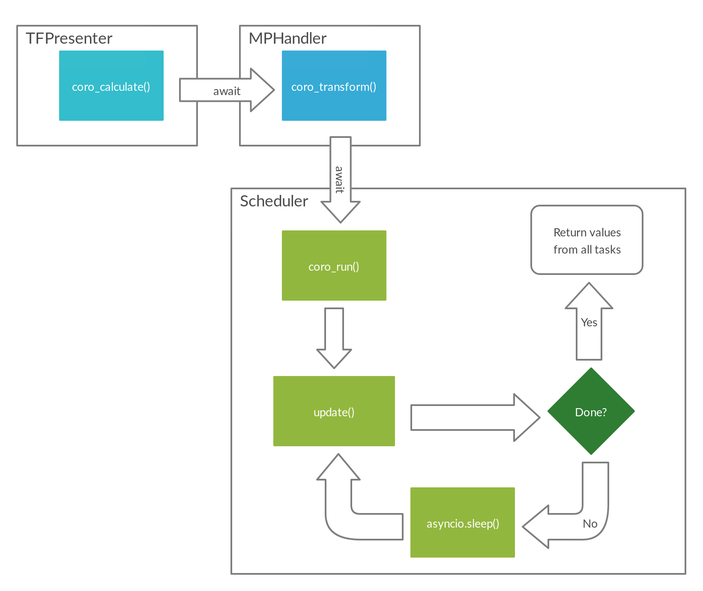

<!-- START doctoc generated TOC please keep comment here to allow auto update -->
<!-- DON'T EDIT THIS SECTION, INSTEAD RE-RUN doctoc TO UPDATE -->
## Table of Contents

- [Developer Guide](#developer-guide)
  - [Additional requirements](#additional-requirements)
  - [Downloading the code](#downloading-the-code)
  - [Installing Git hooks](#installing-git-hooks)
  - [Command-line arguments](#command-line-arguments)
  - [Error handling](#error-handling)
  - [Project structure](#project-structure)
  - [Naming conventions and code style](#naming-conventions-and-code-style)
  - [Concurrency](#concurrency)
    - [multiprocess](#multiprocess)
    - [asyncio](#asyncio)
    - [Combining multiprocessing and asyncio](#combining-multiprocessing-and-asyncio)

<!-- END doctoc generated TOC please keep comment here to allow auto update -->

# Developer Guide

This guide is aimed at developers wishing to modify or contribute to the program, and is 
designed to be accessible to programmers with basic to intermediate knowledge of Python.

> :warning: On macOS and Linux, `python` should be replaced with the appropriate command - usually `python3` - in all commands below.

## Additional requirements
To develop the program, you may need to install additional tools:
- Git is required to download the code, save and upload your changes.
- Qt Designer is required to edit the layout files.

## Downloading the code
If you are not registered as a collaborator, you should [fork the repository](https://help.github.com/en/articles/fork-a-repo). You can then clone your fork to download the code. 

To start running the code, see [preparing to run](../README.md#preparing-to-run).

## Installing Git hooks

Git hooks are used to automatically perform tasks when a commit is made. PyMODA uses `doctoc` to add the table of contents to markdown files, and `black` to format Python files to follow a consistent style.

Commit your current work, if there are changes. Then open a terminal in the `PyMODA` folder and run:

```
pip install pre-commit --user   # Installs the pre-commit tool.
pre-commit install              # Adds the Git hooks to the repository.
```

Now that the Git hooks are installed, they will automatically run every time a commit changes relevant files.

> :warning: When a hook runs, you may need to add the files and commit again.

## Command-line arguments

PyMODA has several command-line arguments, which can make development easier.

> :warning: `-runtime` must be used on Linux, but should not be necessary on other operating systems.

`-runtime` is used to specify the `LD_LIBRARY_PATH` for the MATLAB Runtime. The `LD_LIBRARY_PATH` is shown by the Runtime installer after installation, and should be saved but not be added to the environment variables manually. 

Here is an example of PyMODA being run on Linux:

```
python3 src/main.py -runtime "/usr/local/MATLAB/MATLAB_Runtime/v96/runtime/glnxa64:/usr/local/MATLAB/MATLAB_Runtime/v96/bin/glnxa64:/usr/local/MATLAB/MATLAB_Runtime/v96/sys/os/glnxa64:/usr/local/MATLAB/MATLAB_Runtime/v96/extern/bin/glnxa64"
```

> Tip: You can add command-line arguments like `-runtime` to your PyCharm configuration.

Below is a table listing the other command-line arguments.

| Argument | Use case | Example |
| ------ | ------ | ------- |
| `--no-maximise` | Prevents windows from opening in a maximised state, allowing easier viewing of console output. | `python src/main.py --no-maximise` |
| `--debug` | Disables error handling. | `python src/main.py --debug` | 
| `-freq` | Specifies the sampling frequency to use. This frequency will be automatically selected in dialogs. | `python src/main.py -freq 10` |
| `-file` | Specifies a data file to use. This file will be automatically selected in dialogs. Only designed for data files in the `res/test` folder, and the file name should be prefixed by `test:`. | `python src.main.py -file "test:many_signal.csv"` | 

Command-line arguments can be specified in PyCharm configurations. 

> Tip: Create multiple PyCharm configurations with different `-file` and `-freq` args to easily test different datasets. 

## Error handling

By default, PyMODA attempts to catch all exceptions on the main process and display them in a dialog instead of crashing the program. This can make finding issues more difficult while developing, so the `--debug` command-line argument can be used or added to PyCharm configurations to prevent this behaviour (this may not be necessary on Windows).

## Project structure

Subfolders contain their own README files. When you click on a subfolder, GitHub will render the README below the file structure.

## Naming conventions and code style

PyMODA code should follow the standard guidelines and naming conventions for Python. Code may be formatted with the PyCharm auto-formatter (by default, the shortcut to format a file is `Ctrl`+`Alt`+`L`). 

PyMODA consists of 5 main windows, whose names are abbreviated in the codebase. The abbreviations are as follows:

| Name  | Abbreviation | Example class |
| ------------- | ------------- | ------------- |
| *Time-Frequency* Analysis  | TF | `TFWindow` |
| Wavelet *Phase Coherence* | PC | `PCWindow` |
| *Ridge Extraction* and Filtering  | RE | `REWindow` |
| Wavelet *Bispectrum Analysis*  | BA | `BAWindow` |
| *Dynamical Bayesian* Inference  | DB | `DBWindow` |

## Concurrency

PyMODA uses `multiprocess` and `asyncio`.

### multiprocess

Multiprocessing is necessary for several reasons:
- It allows long calculations to run without freezing the GUI.
- It allows calculations for multiple signals to be executed simultaneously on different CPU cores,
greatly improving performance.
- It allows the circumvention of [a critical issue](https://stackoverflow.com/questions/56758952/matlab-generated-python-packages-conflict-with-pyqt5-on-ubuntu-possible-librar) 
on Linux caused by conflicting libraries used by PyQt5 and the MATLAB Runtime.

While multithreading could be used to solve the first problem, it would not be ideal for 
the second due to CPython's infamous Global Interpreter Lock. The third problem can only be solved by 
using multiple processes.

PyMODA uses the `multiprocess` module rather than the `multiprocessing` module found in 
the standard library, due to problems with the latter's serialization in Windows. 
`multiprocess` has the same API as `multiprocessing`, so the only changes required are the import statements.

### asyncio

`asyncio` allows the `Scheduler` class, which schedules the running of multiple processes, 
to run on the main thread without freezing the GUI. `Scheduler` is run in a coroutine using the Qt event loop from `asyncqt`.

### Combining multiprocessing and asyncio

